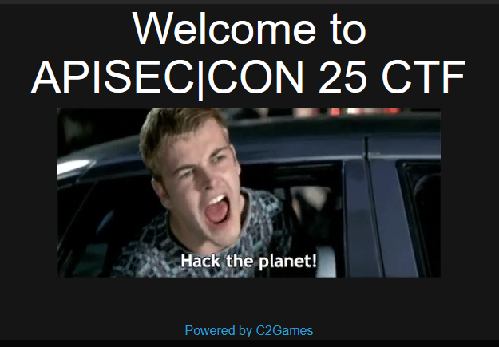
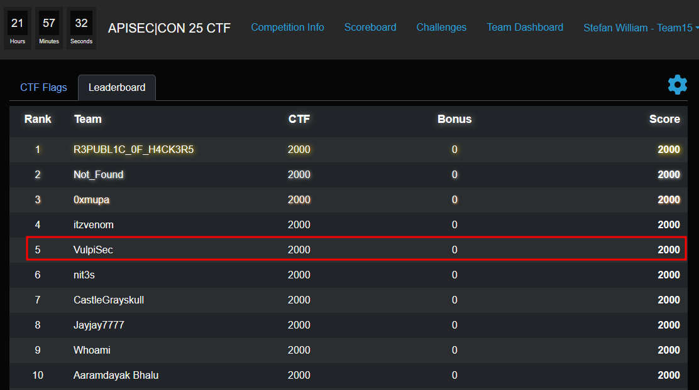

## APISEC 25 CTF

- https://ac25.apisecuniversity.com/

Challenges:

 
    <a href="https://github.com/L4zyFox/CTFs/blob/main/APISEC%20CON%2025%20CTF/02%20-%20Shadow%20APIs.md" target="_blank">Shadow APIs</a> 
    <a href="https://github.com/L4zyFox/CTFs/blob/main/APISEC%20CON%2025%20CTF/03%20-%20Injection%20Junction.md" target="_blank">Injection Junction</a> 
    <a href="https://github.com/L4zyFox/CTFs/blob/main/APISEC%20CON%2025%20CTF/04%20-%20Slash%20and%20Dash.md" target="_blank">Slash and Dash</a> 
    <a href="https://github.com/L4zyFox/CTFs/blob/main/APISEC%20CON%2025%20CTF/05%20-%20BugBountyHub.md" target="_blank">BugBountyHub</a> 
    <a href="https://github.com/L4zyFox/CTFs/blob/main/APISEC%20CON%2025%20CTF/06%20-%20Massive.md" target="_blank">Massive</a> 
    <a href="https://github.com/L4zyFox/CTFs/blob/main/APISEC%20CON%2025%20CTF/07%20-%20%20Permission%20Slip.md" target="_blank">Permission Slip</a> 
    <a href="https://github.com/L4zyFox/CTFs/blob/main/APISEC%20CON%2025%20CTF/08%20-%20Rate%20My%20API.md" target="_blank">Rate My API</a> 

 
 

Scoreboard:

 
 

