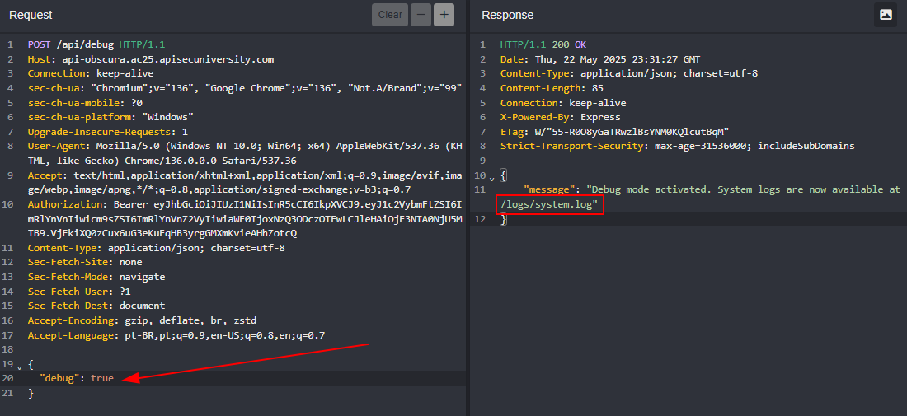

## Shadow APIs

### Undocumented  

Designed By: MikeHacksThings - Maltek Solutions  
Points: 50 Create Task

Welcome to the Secure Notes App! Our developers have created a robust note-taking application with proper authentication and authorization. This challenge presents a web application with a fully functional API. However, there might be more to this API than meets the eye.

[https://undocumented.ac25.apisecuniversity.com](https://undocumented.ac25.apisecuniversity.com)

Solution:

When accessing the application and inspecting the requests made on the home page, it's possible to observe the "api.min.js" component.


Inside "api.min.js", you can spot a debug token and some important API elements, such as the base directory and the "debug" endpoint:


Just by accessing the mentioned endpoint, an "access denied" error message was returned:


So I added the found token to the request header using "Authorization: Bearer".


```json
flag{h1dd3n_3ndp01nt5_4r3_n0t_s3cur3}
```

### API Obscura  

Designed By: MikeHacksThings - Maltek Solutions  
Points: 100 Create Task

Welcome back to the Secure Notes App! After our security team discovered the previous vulnerability, we updated the application to make it more secure. The debug token no longer provides direct access to the flag endpoint. Can you navigate through these layers of security to find the flag?

[https://api-obscura.ac25.apisecuniversity.com](https://api-obscura.ac25.apisecuniversity.com)

Solution:

Just like in the previous challenge, the `api.min.js` file is loaded.


A token is still present, but a new endpoint (`admin`) was discovered. Additionally, the `debug` endpoint now accepts the POST method.


If you try to access `/api/debug` using the GET method, an error is returned.


When making the request using POST and adding the token found in `api.min.js` to the header, a new error appears. This time, a JSON response indicates that the `debug` parameter is required.


So I added the header `Content-Type: application/json; charset=utf-8` as suggested in the previous response, and included the `debug` parameter in JSON format, passing a test string to see what the server would return.


It turned out that the parameter only accepted boolean values (`true` or `false`). I passed the value `true`, and the response revealed a new file.



By accessing the file `/logs/system.log` using the debug token, it was possible to identify a new token, this time, an admin token!


Using this newly found token to access the previously discovered `/api/admin` endpoint, the flag was revealed.


```json
flag{mult1_st3p_t0k3n_3sc4l4t10n_vuln}
```