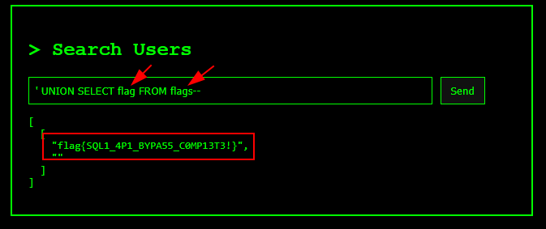

## Injection Junction

### The Search for Secrets  

Designed By: Josh Cutting - Maltek Solutions  
Points: 50 Create Task

You’ve stumbled across a sketchy search API that talks directly to a database—and it’s a little _too_ trusting. Beneath the surface lies a hidden flag, buried deep in the records of the `admin` user.  
Your task? Twist the query to your will. Inject a little chaos. Reveal the secret the system desperately wants to hide. A perfect intro to SQL injection—and a satisfying way to outsmart careless devs.

[https://search-for-secrets.ac25.apisecuniversity.com](https://search-for-secrets.ac25.apisecuniversity.com)

Solution:

Right away, knowing this was an SQL injection exercise, I tried a simple payload and was able to display the entire list of users.


Then I enumerated how many elements were being displayed. In this case, just one!


Next, I tried to figure out which DBMS I was dealing with by testing several functions specific to different DBMSs until one worked, in this case, SQLite.


With this, I was able to write the queries in the correct syntax to retrieve the data I wanted. First, I listed the tables:

```
' UNION SELECT name FROM sqlite_master WHERE type='table' --
```


Then I displayed the column names of the target table:

```
' UNION SELECT sql FROM sqlite_master WHERE type='table' AND name='flags'--
```


And with this information, I just displayed the contents of the table.

```
' UNION SELECT flag FROM flags--
```



```json
flag{SQL1_4P1_BYPA55_C0MP13T3!}
```

### Break the Gate  

Designed By: Josh Cutting - Maltek Solutions  
Points: 100 Create Task

Welcome to the gates of the system—locked tight behind a login screen that _thinks_ it's secure. Unfortunately for them (and fortunately for you), this API trusts user input way too much.  
Your mission: slip past the defenses using classic SQL injection trickery and hijack the `admin` session—no password required. Once inside, sniff out the hidden flag and show them why sanitizing input isn’t optional.

[https://break-the-gate.ac25.apisecuniversity.com](https://break-the-gate.ac25.apisecuniversity.com)

Solution:

In this challenge, there was a login panel where I tried to enter with weak credentials just to test the behavior.


With a simple payload, it was possible to bypass authentication, confirming the entry point for SQL injection.


Next, I tried to enumerate the displayed elements and, in a strange way, the flag was shown (not sure if this was the correct way to solve the challenge XD).

```
admin' union select 1,2 --
```


```json
flag{wh0_n33ds_p4ssw0rds_wh3n_y0u_h4v3_sql1}
```