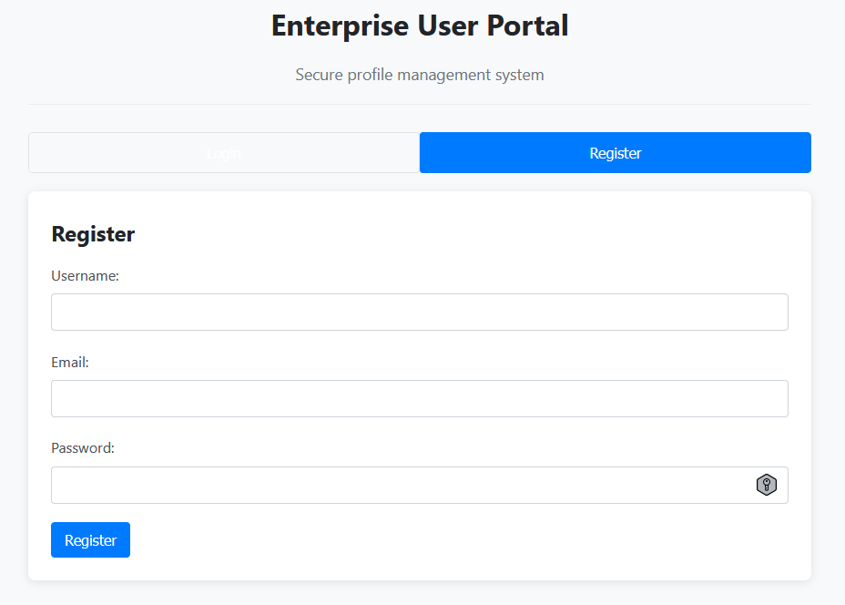
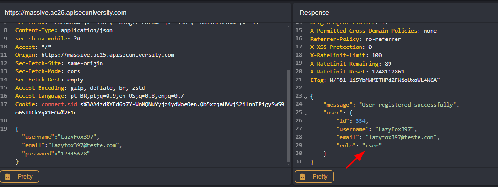
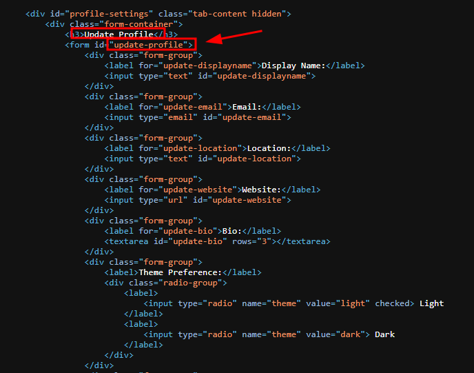
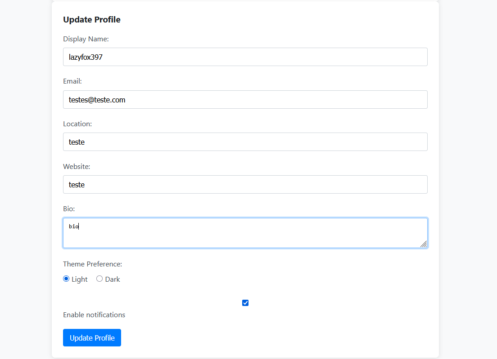
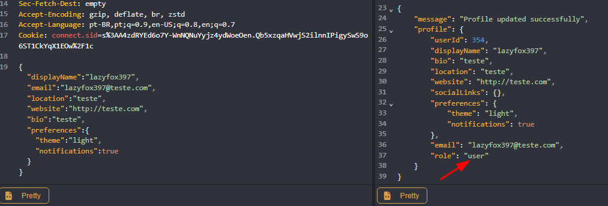
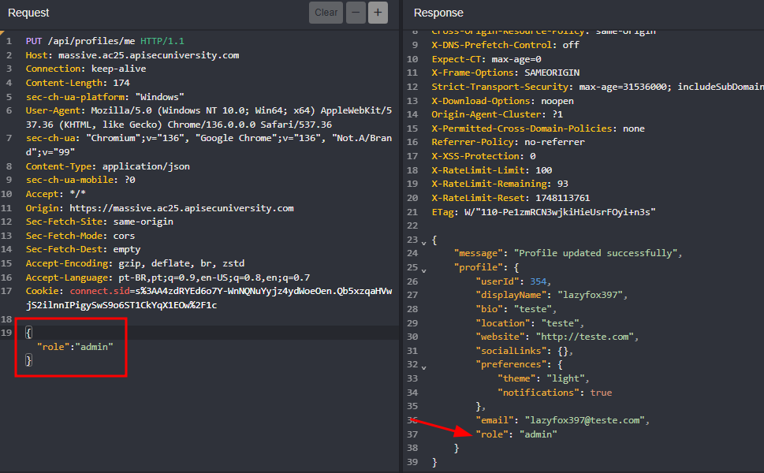
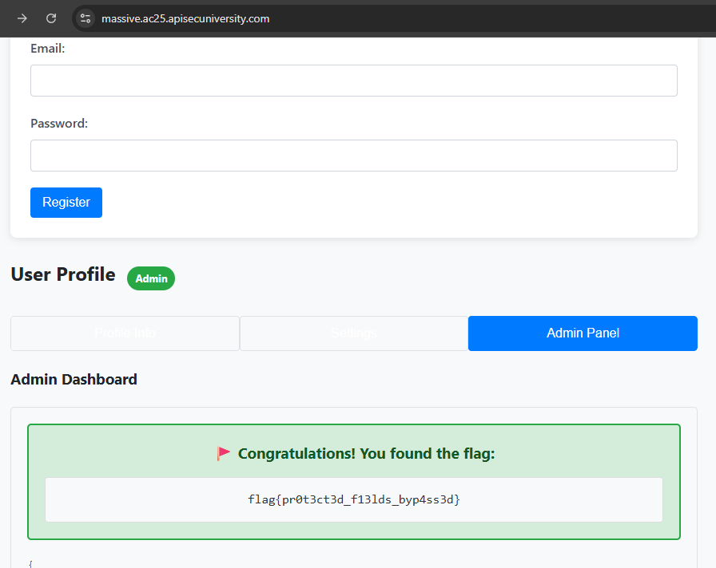
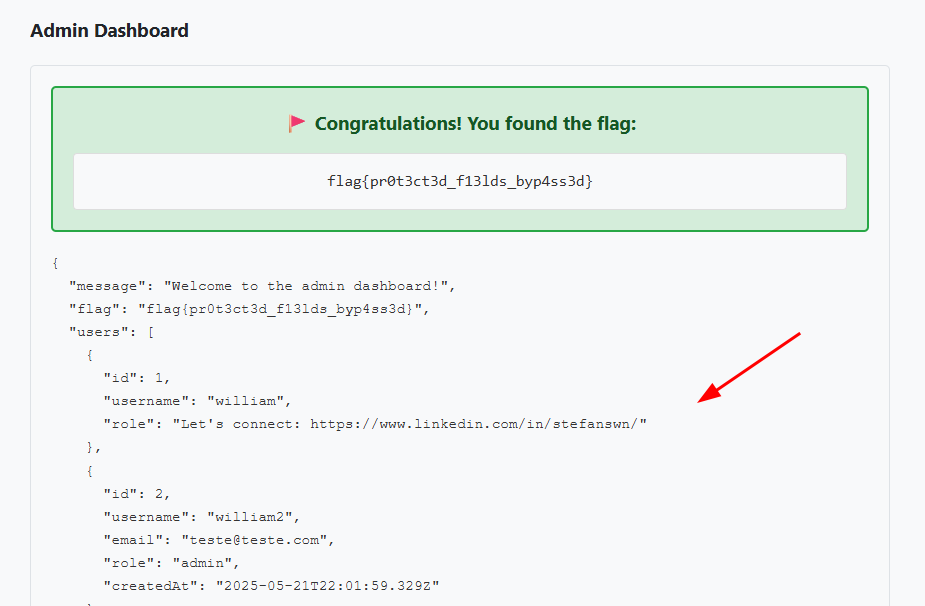

## Massive

### Massive  

Designed By: MikeHacksThings - Maltek Solutions  
Points: 150 Create Task

This challenge presents an enterprise-grade user management portal. The developers have implemented a profile update feature, but they might not be properly validating user input. Your goal is to find a way to escalate your privileges to admin and access the admin dashboard.

[https://massive.ac25.apisecuniversity.com](https://massive.ac25.apisecuniversity.com)

Solution:

Although the prompt mentioned a profile update feature, I couldn't find anything visible on the presented page.



I created a user and tried to log in. Nothing changed in the application. I attempted to modify the user's role to "admin" directly during registration, but it wasn't possible.



Analyzing the page source code, I noticed that the profile update feature exists but is hidden.



To reveal this feature, I had to remove the `hidden` class. In the browser Console, I entered:

```js
document.getElementById("profile-section").classList.remove("hidden");
document.getElementById("profile-settings").classList.remove("hidden");
```

And just like that, the feature became visible.



By intercepting the request made by the profile update feature (`/api/profiles/me`), I was able to see more information about the user and understand how the update request was structured.



With that, I just repeated the request with the field I wanted to modify, in this case, setting the role to `"admin"`.



After logging in with the user, I ran the commands again to reveal the hidden features and accessed the Admin Panel tab to find the flag.

```js
document.getElementById("profile-section").classList.remove("hidden");
document.getElementById("profile-settings").classList.remove("hidden");
```



```json
flag{pr0t3ct3d_f13lds_byp4ss3d}
```

I left a little message behind =]


