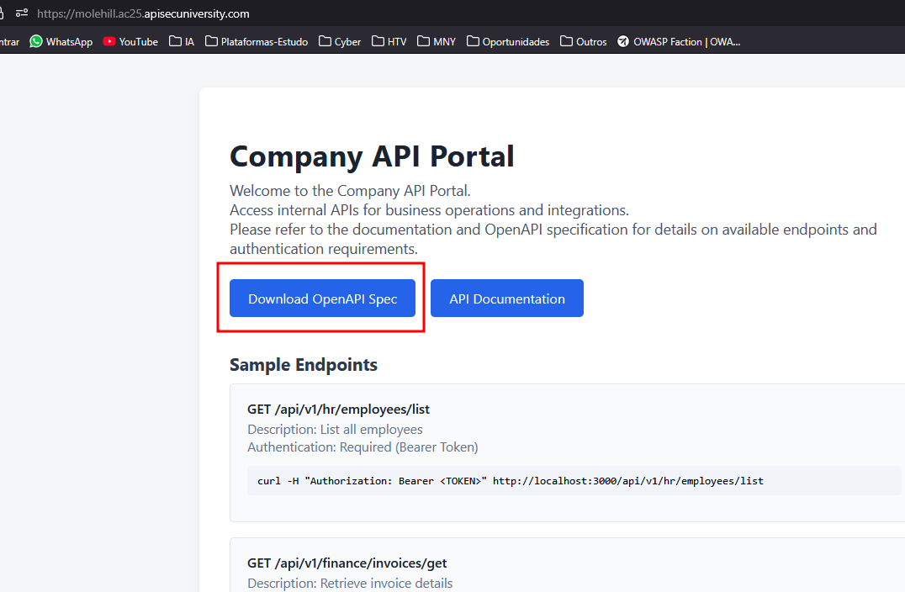
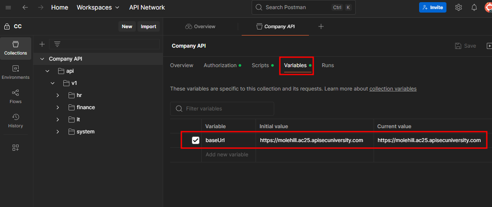
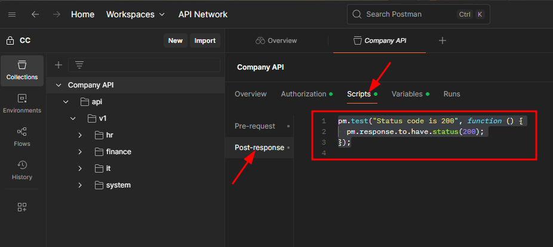
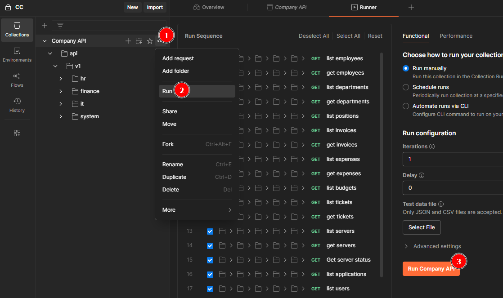
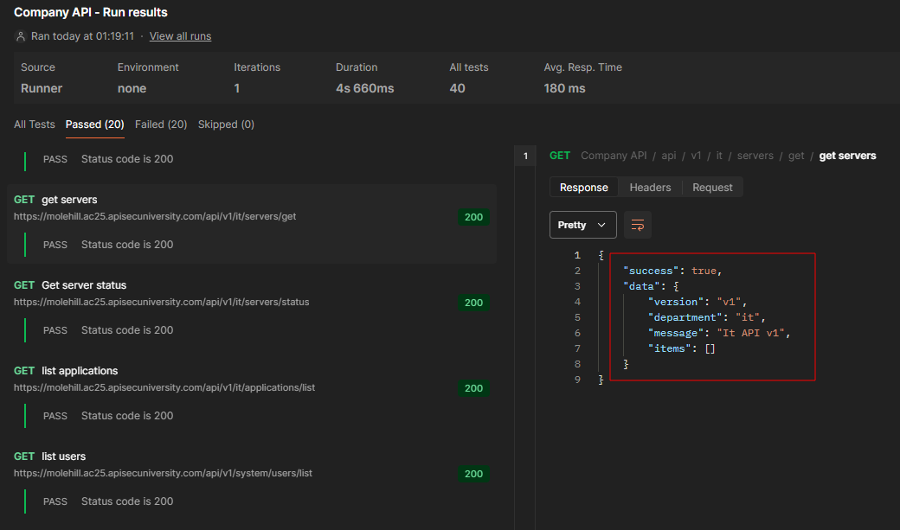
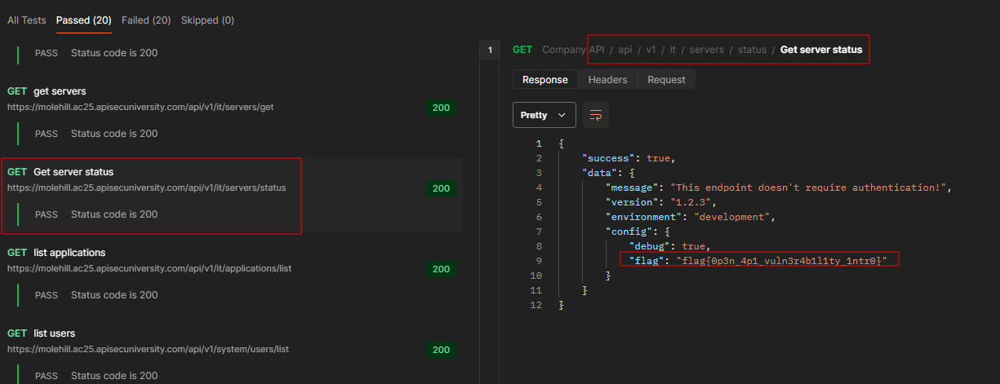
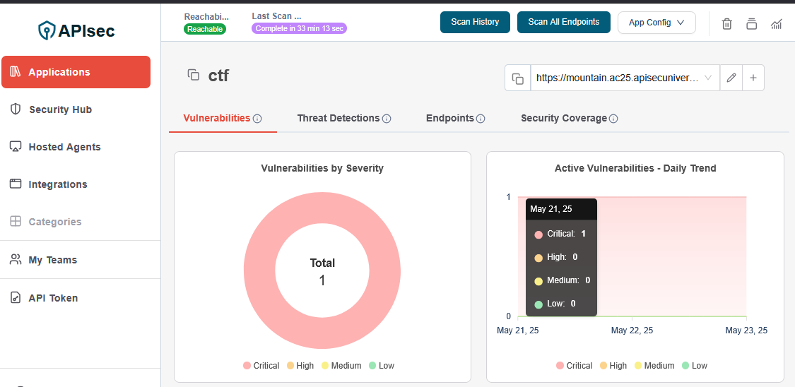
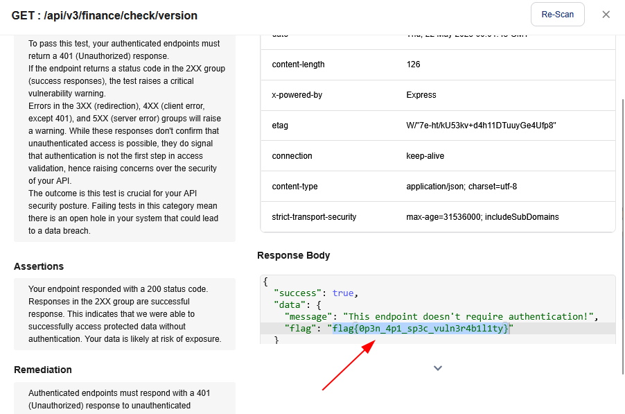

##  Permission Slip

### Molehill  

Designed By: MikeHacksThings - Maltek Solutions  
Points: 50 Create Task

A company has exposed their API documentation through an OpenAPI specification. Most endpoints require authentication, but there might be a misconfiguration where an endpoint that should require authentication doesn't actually enforce it.

Your task is to:

1. Analyze the OpenAPI specification  
2. Find the endpoint that doesn't properly enforce authentication  
3. Extract the flag from the vulnerable endpoint  

[https://molehill.ac25.apisecuniversity.com](https://molehill.ac25.apisecuniversity.com)

For this challenge, I downloaded the API's Swagger file and imported it into Postman.



In Postman, I changed the value of the "baseUrl" variable to the application site.



After that, I added a script to test if a GET request to an endpoint returned status 200. This way, I could verify which endpoint returns a positive response without needing a token.

```
pm.test("Status code is 200", function () {
  pm.response.to.have.status(200);
});
```



With that in place, I just selected the collection and ran the script for all endpoints.



In this case, it didn’t work very well, as almost all requests returned a 200 status code with the same content:



However, by analyzing the responses, I noticed that one of them returned something different. The endpoint `/api/v1/it/servers/status` returned other information, including the flag.



```json
flag{0p3n_4p1_vuln3r4b1l1ty_1ntr0}
```


### Mountain  

Designed By: MikeHacksThings - Maltek Solutions  
Points: 200 Create Task

A company has exposed their API through an OpenAPI specification. All endpoints require authentication, but there might be a misconfiguration where an endpoint that should require authentication doesn't actually enforce it.

Your task is to:

1. Analyze the OpenAPI specification  
2. Find the endpoint that doesn't properly enforce authentication  
3. Extract the flag from the vulnerable endpoint  

If this seems daunting, try using the APISec Scanner to help you! ([https://www.apisec.ai/sign-up](https://www.apisec.ai/sign-up))

[https://mountain.ac25.apisecuniversity.com](https://mountain.ac25.apisecuniversity.com)

For this challenge, I followed the tip from the description and used the APIsec platform to scan the application by uploading the Swagger specification.



I found a critical alert in the endpoint `/api/v3/finance/check/version`, and it contained the flag.



```json
flag{0p3n_4p1_sp3c_vuln3r4b1l1ty}
```
